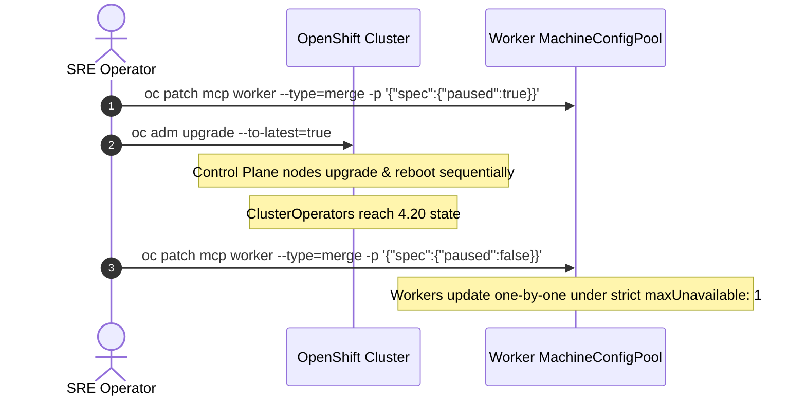

# Cluster Lifecycle & EUS-to-EUS Upgrades

OpenShift 4.20 supports Extended Update Support (EUS), allowing enterprise organizations to transition between even-numbered releases (e.g. 4.18 -> 4.20) with minimal disruption.

---

## Safe Upgrade Methodology: Paused MachineConfigPools

To prevent all worker nodes from restarting simultaneously during a major upgrade, pause the worker pool before initiating the cluster update:

---
[Back to Day 2 Index](README.md) • [Next Chapter: Backup, DR & Rebuild](../08-backup-dr-and-rebuild/README.md)
