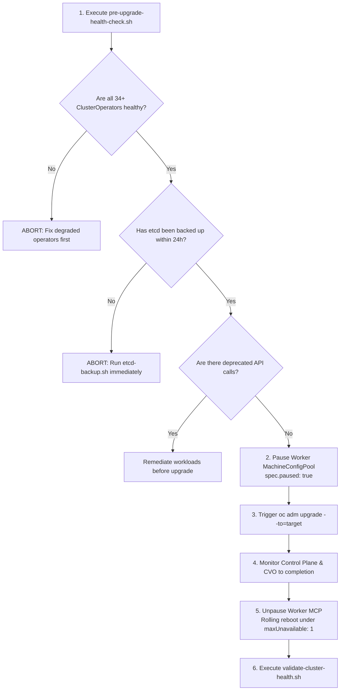

# Automated Cluster Lifecycle & Upgrade Engineering

OpenShift 4.20 introduces enhanced lifecycle management, supporting Extended Update Support (EUS), automated canary worker pools, and disconnected update pipelines.

---

## Why OpenShift Upgrades Require Strict Orchestration

Unlike generic Kubernetes distributions where upgrading involves replacing binary packages manually, OpenShift orchestrates hundreds of coordinated tasks across operating systems and control plane operators:
1. **RHCOS In-Place Pivot**: Every node upgrade downloads an ostree container payload and updates the underlying operating system kernel, systemd units, and CRI-O configuration.
2. **Kubernetes API Deprecations**: The Kubernetes version advances (e.g. 1.31 -> 1.32). Applications using deprecated APIs will fail unless identified beforehand.
3. **Control Plane Quorum Lock**: If etcd Raft consensus fails during an upgrade, the API goes down permanently.
4. **No Rollback Capability**: Kubernetes and OpenShift **do not support automated downgrades/rollbacks** once etcd schema migrations have occurred. Restoring an etcd snapshot taken immediately prior to the upgrade is the **only disaster recovery mechanism**.

---

## Mandatory Pre-Upgrade Architecture & Checklist



---

## Upgrade Scenarios & Automation Scripts

## End-to-End Step-by-Step Implementation Procedure

### Step 1: Pre-Upgrade Health & Readiness Audit
1. Execute the automated pre-upgrade verification script:
   ```bash
   ./scripts/pre-upgrade-health-check.sh
   ```
2. Confirm that all 34+ ClusterOperators report `Available=True`, `Progressing=False`, and `Degraded=False`.
3. Verify that no MachineConfigPools are degraded or currently applying updates.

### Step 2: Perform Mandatory Pre-Upgrade etcd Snapshot
1. Prior to triggering any upgrade, take an automated etcd snapshot:
   ```bash
   ./scripts/etcd-backup.sh
   ```
2. Verify that the backup archive exists in `/var/recovery/etcd-backups/` and contains a non-zero byte `snapshot.db`.

### Step 3: Pause the Worker MachineConfigPool
1. Prevent compute workloads from rebooting concurrently while the control plane updates:
   ```bash
   oc patch mcp worker --type=merge -p '{"spec":{"paused":true}}'
   ```
2. Confirm the worker pool status:
   ```bash
   oc get mcp worker
   ```

### Step 4: Initiate Cluster Version Upgrade
1. In connected environments:
   ```bash
   oc adm upgrade --to=4.20.1
   ```
2. In air-gapped environments, run the automated mirror and upgrade script:
   ```bash
   LOCAL_REGISTRY=quay.internal.corp:8443/openshift4 ./scripts/airgap-upgrade.sh 4.20.1
   ```

### Step 5: Monitor Control Plane & ClusterVersion Operator (CVO)
1. Monitor the upgrade progression:
   ```bash
   oc get clusterversion -w
   ```
2. Wait until the control plane reports `Completed` and all masters reboot sequentially with the new kernel.

### Step 6: Unpause Worker Pool & Canary Rollout
1. Unpause the worker MachineConfigPool:
   ```bash
   oc patch mcp worker --type=merge -p '{"spec":{"paused":false}}'
   ```
2. The Machine Config Operator drains and reboots worker nodes one-by-one under strict `maxUnavailable: 1` limits.

### Step 7: Post-Upgrade Cluster Health Verification
1. Run the health verification tool to ensure all operators, nodes, and ingress routers are healthy:
   ```bash
   ./scripts/validate-cluster-health.sh
   ```

### Scenario 1: Standard Production Upgrade (Connected / Hybrid)
Utilize [`scripts/automated-cluster-upgrade.sh`](../../scripts/automated-cluster-upgrade.sh):
```bash
./scripts/automated-cluster-upgrade.sh 4.20.1
```
The script automatically:
1. Executes [`scripts/pre-upgrade-health-check.sh`](../../scripts/pre-upgrade-health-check.sh).
2. Takes an automated etcd snapshot via [`scripts/etcd-backup.sh`](../../scripts/etcd-backup.sh).
3. Pauses the worker `MachineConfigPool` (`oc patch mcp worker --type=merge -p '{"spec":{"paused":true}}'`).
4. Initiates the upgrade and monitors the Cluster Version Operator (CVO).
5. Unpauses the worker pool for controlled sequential worker draining and node updates.
6. Runs post-upgrade health verification.

### Scenario 2: Disconnected / Air-Gapped Cluster Upgrade
Air-gapped clusters cannot reach `api.openshift.com` or `quay.io`. Run [`scripts/airgap-upgrade.sh`](../../scripts/airgap-upgrade.sh):
```bash
LOCAL_REGISTRY=quay.internal.corp:8443/openshift4 ./scripts/airgap-upgrade.sh 4.20.1
```
The script:
1. Mirrors the release payload, metadata, and graph using `oc-mirror` v2.
2. Applies the generated `ImageDigestMirrorSet` (IDMS) manifests.
3. Initiates the upgrade directly using the mirrored release image digest.

### Scenario 3: Single Node OpenShift (SNO) Upgrade
- Because SNO runs control plane and user workloads on a single physical host, an upgrade **will cause temporary workload downtime** during the node reboot (typically 3 to 7 minutes).
- SNO upgrades should be scheduled during maintenance windows or coordinated fleet-wide via Red Hat Advanced Cluster Management (ACM) and TALM.

---
[Back to Day 2 Index](README.md) • [Next Chapter: Backup, DR & Rebuild](../08-backup-dr-and-rebuild/README.md)
