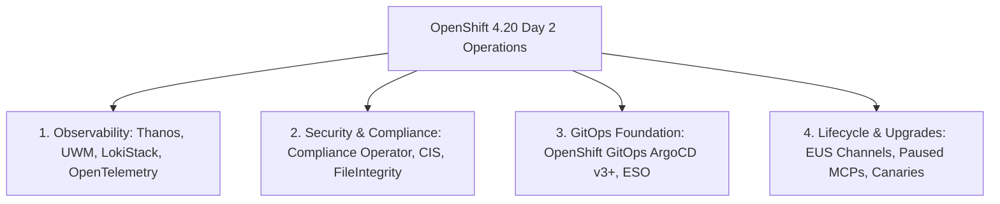

# 07 - Day 2 Operations, Fleet Management & Lifecycle

Day 2 operations define the ongoing maintenance, observability, compliance enforcement, and automated lifecycle of production OpenShift 4.20 clusters.

---

## Day 2 Operational Pillars

---
[Back to Global Navigation](../00-navigation.md)
