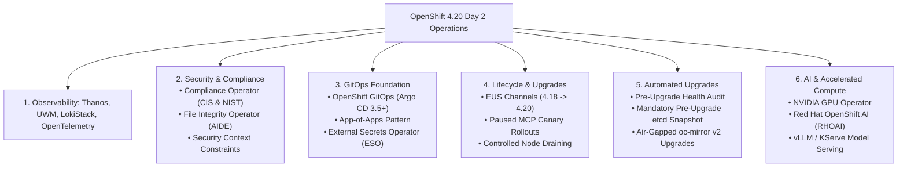

# 07 - Day 2 Operations, Fleet Management & Lifecycle

Day 2 operations define the ongoing maintenance, observability, compliance enforcement, AI workloads, and automated lifecycle of production OpenShift 4.20 clusters.

---

## Day 2 Operational Pillars

---

## Section Documents
- [01. Enterprise Observability Stack](01-observability-stack.md)
- [02. Security, Governance & Compliance](02-security-and-compliance.md)
- [03. GitOps Foundation (Argo CD 3.5+ & ESO)](03-gitops-foundation.md)
- [04. Cluster Lifecycle & EUS Upgrades](04-lifecycle-and-upgrades.md)
- [05. Automated Upgrades & Orchestration](05-automated-upgrades.md)
- [06. GitOps App-of-Apps: Fleet Orchestration](06-gitops-app-of-apps.md)
- [07. Red Hat OpenShift AI (RHOAI) & GPU Acceleration](07-openshift-ai-gpu.md)

---
[Back to Global Navigation](../00-navigation.md)
