# OADP vs Vanilla Velero: Exhaustive Architectural Evaluation

A frequent question among platform architects is: **"Can we simply install vanilla upstream Velero on OpenShift instead of OADP?"**

The definitive technical verdict is: **NO. Vanilla Velero is neither recommended nor supported on OpenShift. OADP is mandatory.**

---

## Technical Comparison Matrix

| Capability / Requirement | Vanilla Upstream Velero | Red Hat OADP (OpenShift API for Data Protection) |
| :--- | :---: | :---: |
| **OpenShift CRD Support** | ❌ Fails (Ignores OpenShift metadata) | ✅ Native OpenShift Backup Plugin included |
| **Security Context Constraints (SCC)** | ❌ Blocked by restricted-v2 SCC | ✅ Pre-configured with compliant privileged SCCs |
| **Route & Ingress Translation** | ❌ Drops Route metadata & certificates | ✅ Restores full TLS keys, CA certs, and route endpoints |
| **DeploymentConfig & BuildConfig** | ❌ Fails to translate triggers/revisions | ✅ Preserves build history, image streams, and triggers |
| **UID / GID Range Preservation** | ❌ Breaks when restoring across namespaces | ✅ Translates OpenShift allocated UID/GID ranges |
| **CSI VolumeSnapshot Integration** | Requires manual configuration | ✅ Automated out-of-the-box via CSI plugin |
| **Red Hat Enterprise Support** | ❌ Unsupported (Community only) | ✅ Full Red Hat L1-L3 24x7 Production SLA |

---

## Why Vanilla Velero Fails on OpenShift

```mermaid
flowchart TD
    subgraph VanillaVelero["Upstream Vanilla Velero"]
        V1["Treats cluster as generic Vanilla Kubernetes"]
        V2["Ignores OpenShift-specific API Groups (route.openshift.io, security.openshift.io)"]
        V3["Cannot map auto-generated ServiceAccount tokens"]
        V4["Fails namespace UID range reconciliation on restore"]
        V1 --> V2 --> V3 --> V4 --> Failure["Workload CrashLoopBackOff & Permission Denied on Restore"]
    end

    subgraph OADP["Red Hat OADP Solution"]
        O1["Includes openshift-velero-plugin"]
        O2["Cleans cluster-scoped metadata and recreates Routes, SCCs, ImageStreams"]
        O3["Re-allocates valid UID/GID ranges in target namespace"]
        O4["Integrates with DataProtectionApplication CRD"]
        O1 --> O2 --> O3 --> O4 --> Success["Clean, One-Click Application Recovery"]
    end
```

---

## Recommended OADP Configuration in 2026
In OpenShift 4.20, configure OADP with **Kopia** as the data-mover uploader rather than legacy Restic, providing up to 4x faster backup speeds and deduplication (see [`configs/day2/oadp-dpa-cr.yaml`](../../configs/day2/oadp-dpa-cr.yaml)).

---
[Next: Metro-DR & Regional-DR](03-metro-dr-and-regional-dr.md) • [Back to DR Index](README.md)
