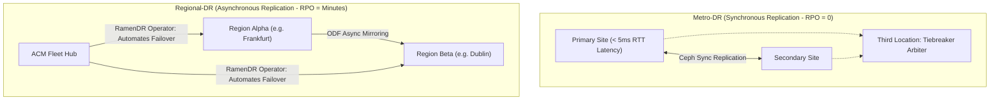

# Metro-DR & Regional-DR Multi-Cluster Architectures

For mission-critical Tier-0 applications, single-cluster backup is insufficient. OpenShift 4.20 pairs **Red Hat Advanced Cluster Management (ACM)** with **OpenShift Data Foundation (ODF)** to provide automated multi-cluster disaster recovery.

---

## Architecture: Metro-DR vs Regional-DR



---

## End-to-End Step-by-Step Implementation Procedure

### Step 1: Deploy Dual Clusters with Low-Latency Interconnect
1. Deploy Primary Cluster (Site A) and Secondary Cluster (Site B).
2. For Metro-DR, verify round-trip network latency is strictly **< 10ms RTT**.

### Step 2: Establish Cross-Cluster Networking via Submariner
1. On the ACM Hub, deploy **Submariner** to connect the overlay pod networks of Site A and Site B via IPsec or WireGuard tunnels:
   ```bash
   subctl join --kubeconfig site-a.kubeconfig broker-info.subm
   subctl join --kubeconfig site-b.kubeconfig broker-info.subm
   ```

### Step 3: Install ODF Multi-Cluster Disaster Recovery (ODF-MCDR)
1. Install ODF and the **OpenShift Disaster Recovery (ODR) / Ramen Operator** on the ACM Hub and managed clusters.

### Step 4: Configure DRPolicy Custom Resource
1. On the ACM Hub, define the replication policy:
   ```yaml
   apiVersion: ramendr.openshift.io/v1alpha1
   kind: DRPolicy
   metadata:
     name: sync-metro-policy
   spec:
     drClusters:
       - site-a
       - site-b
     schedulingInterval: 0m  # 0m denotes synchronous Metro-DR (RPO=0)
   ```

### Step 5: Protect Application Workloads via DRPlacementControl
1. Bind target workloads to the DR policy via `DRPlacementControl`:
   ```yaml
   apiVersion: ramendr.openshift.io/v1alpha1
   kind: DRPlacementControl
   metadata:
     name: payment-app-drpc
     namespace: payment-system
   spec:
     drPolicyRef:
       name: sync-metro-policy
     placementRef:
       kind: Placement
       name: payment-app-placement
     preferredCluster: site-a
   ```

### Step 6: Execute Automated Disaster Failover Drill
1. Trigger a failover to Site B:
   ```bash
   oc patch drpc payment-app-drpc -n payment-system --type=merge -p '{"spec":{"action":"Failover","failoverCluster":"site-b"}}'
   ```
2. The Ramen Operator stops workloads on Site A, fences storage, promotes Ceph storage on Site B, and launches pods on Site B in under 2 minutes!

---
[Next: Declarative GitOps Rebuild](04-declarative-rebuild-gitops.md) • [Back to DR Index](README.md)
