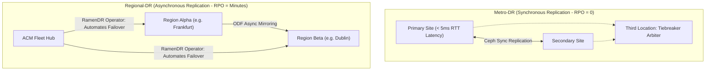

# Metro-DR & Regional-DR Multi-Cluster Architectures

For mission-critical Tier-0 applications, single-cluster backup is insufficient. OpenShift 4.20 pairs **Red Hat Advanced Cluster Management (ACM)** with **OpenShift Data Foundation (ODF)** to provide automated multi-cluster disaster recovery.

---

## Architecture: Metro-DR vs Regional-DR

---

## Technical Latency Requirements

| Architecture | Maximum Allowed Network Latency | RPO | RTO | Failover Mechanism |
| :--- | :--- | :---: | :---: | :--- |
| **Metro-DR** | **< 10ms RTT** (Strict storage sync) | **0 seconds** | < 2 minutes | Automated via ODF stretch cluster |
| **Regional-DR**| **Any WAN latency** (e.g. 50-150ms) | **1 - 15 minutes** | < 15 minutes | Orchestrated via ACM Ramen Operator |

---
[Next: Declarative GitOps Rebuild](04-declarative-rebuild-gitops.md) • [Back to DR Index](README.md)
