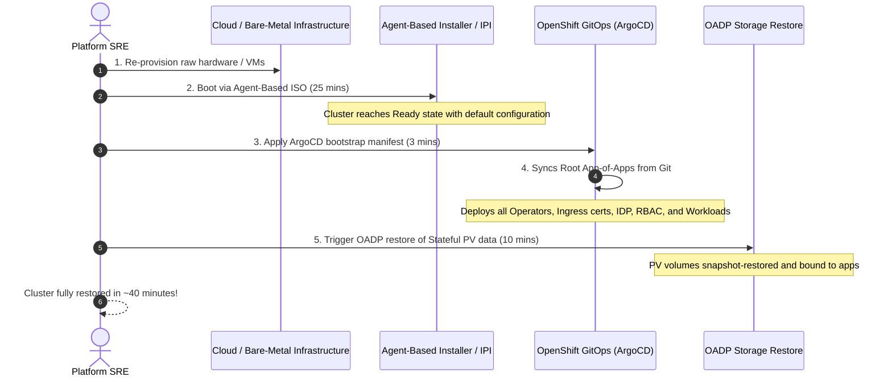

# Declarative Cluster Rebuild from Scratch with GitOps

The most modern disaster recovery pattern for cloud-native platforms is **treating the entire OpenShift cluster as disposable infrastructure**.

Rather than troubleshooting corrupted etcd databases during a catastrophe, platform teams rebuild the entire cluster from scratch in under 45 minutes.

---

## The Rebuild-from-Scratch Workflow

---

## Essential Components of Pure GitOps Rebuilds

1. **All Cluster Configurations in Git**:
   - MachineConfigs, IngressControllers, OAuth, StorageClasses, and Operators declared in Kustomize / Helm.
2. **Zero In-Cluster State in Day 0/1**:
   - No manual `oc create` commands executed directly on the cluster.
3. **Decoupled Persistent Data**:
   - Database PVs backed up to external S3 object stores via OADP, ready to be mounted during step 5 of the recovery pipeline.

---
[Back to DR Index](README.md) • [Back to Global Navigation](../00-navigation.md)
