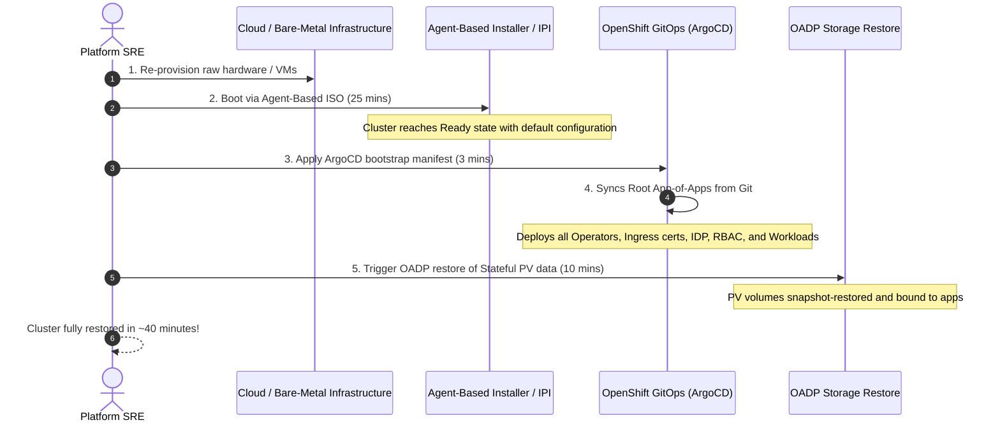

# Declarative Cluster Rebuild from Scratch with GitOps

The most modern disaster recovery pattern for cloud-native platforms is **treating the entire OpenShift cluster as disposable infrastructure**.

Rather than troubleshooting corrupted etcd databases during a catastrophe, platform teams rebuild the entire cluster from scratch in under 45 minutes.

---

## The Rebuild-from-Scratch Workflow



#### Architectural Breakdown: Immutable Rebuild & GitOps Restoration Workflow

- **Phase 1: Bare Infrastructure Re-Provisioning (Step 1)**: Reset disks and power cycle physical nodes or cloud instances to pristine state via Out-of-Band Redfish, VMware vCenter API, or Terraform.
- **Phase 2: Automated ABI / IPI Cluster Bootstrap (Step 2)**: Boot the nodes from pre-generated `agent.x86_64.iso` or cloud installer; cluster converges autonomously to a healthy bare-metal OpenShift 4.20 state with default configurations in ~25 minutes.
- **Phase 3: GitOps App-of-Apps Bootstrap (Steps 3 & 4)**: SRE applies a single root Argo CD bootstrap manifest; OpenShift GitOps connects to the central Git repository and reconciles the entire cluster state (Day 1 hardening, custom PKI, Ingress TLS, machine pools, Operators, and workload manifests) in ~3 minutes.
- **Phase 4: OADP Stateful Data Restoration (Step 5)**: OpenShift API for Data Protection (OADP / Velero) restores persistent volume (PV) snapshots from S3/MinIO object storage, re-binding application databases and stateful queues in ~10 minutes.
- **Recovery SLA**: Entire Tier-0/Tier-1 cluster restored to 100% operational fidelity in under 40 minutes, completely eliminating manual configuration drift and fragile runtime patches.

---

## End-to-End Step-by-Step Implementation Procedure

### Step 1: Re-Provision Hardware / VMs
1. In the event of catastrophic data center destruction, trigger server provisioning (Bare Metal Redfish, VMware vCenter, or Cloud Terraform).
2. Reset server boot disks to clean state.

### Step 2: Boot OpenShift 4.20 Base Cluster
1. Boot the nodes using the stored `agent.x86_64.iso` or trigger cloud IPI:
   ```bash
   openshift-install agent wait-for install-complete --dir=./recovery-workspace
   ```
2. The cluster converges into a fresh, baseline OpenShift 4.20 cluster in ~25 minutes.

### Step 3: Install OpenShift GitOps Operator
1. Apply the GitOps operator subscription:
   ```bash
   oc apply -f configs/day2/gitops-operator-sub.yaml
   oc wait --for=condition=Ready pod -l app.kubernetes.io/name=openshift-gitops-server -n openshift-gitops --timeout=300s
   ```

### Step 4: Apply Root GitOps App-of-Apps
1. Point ArgoCD to the disaster recovery cluster configuration repository:
   ```yaml
   apiVersion: argoproj.io/v1alpha1
   kind: Application
   metadata:
     name: root-cluster-app
     namespace: openshift-gitops
   spec:
     project: default
     source:
       repoURL: https://github.com/nubenetes/cluster-fleet-gitops.git
       targetRevision: main
       path: clusters/prod-cluster-01
     destination:
       server: https://kubernetes.default.svc
       namespace: default
     syncPolicy:
       automated:
         prune: true
         selfHeal: true
   ```
2. ArgoCD automatically deploys:
   - Cluster Operators (ODF, OADP, Logging, Compliance).
   - Ingress wildcard TLS certificates and custom CA bundles.
   - Identity Provider (Keycloak / Entra ID) and RBAC bindings.
   - All tenant application deployments, statefulsets, and routes.

### Step 5: Restore Application Stateful Data via OADP
1. Once OADP is reconciled by ArgoCD, trigger the restore of persistent volume data from the off-site S3 backup bucket:
   ```bash
   oc apply -f configs/dr/restore-stateful-workloads.yaml
   ```
2. Application pods bind to restored volume snapshots and resume business operations.

---
[Back to DR Index](README.md) • [Back to Global Navigation](../00-navigation.md)
