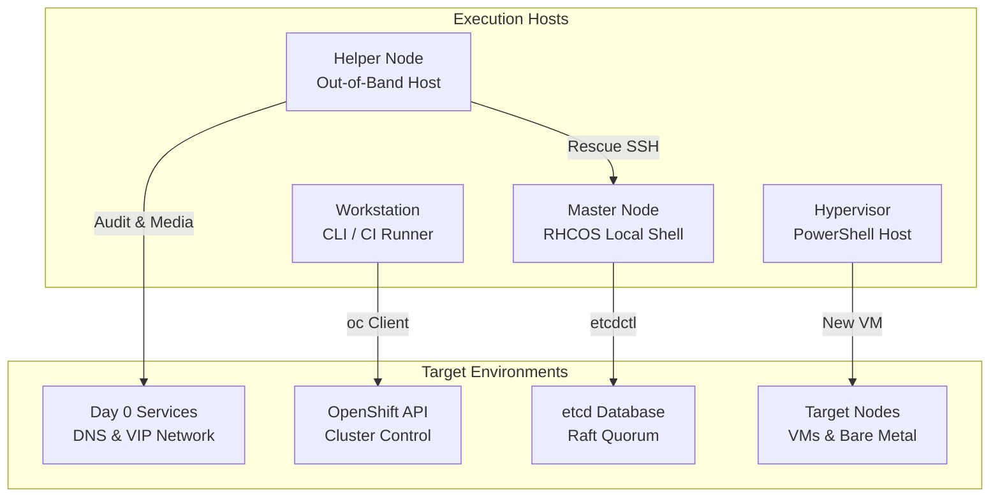
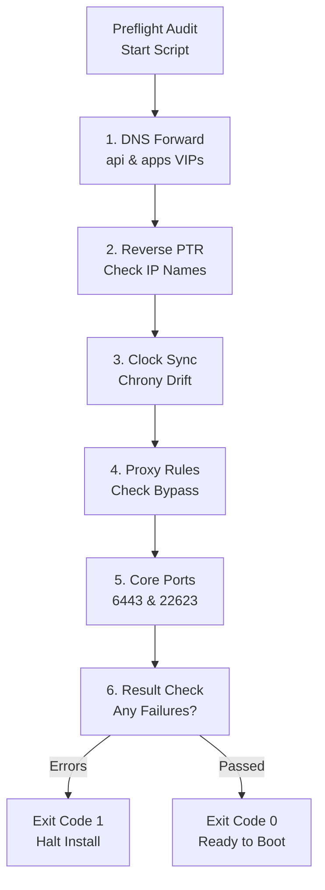
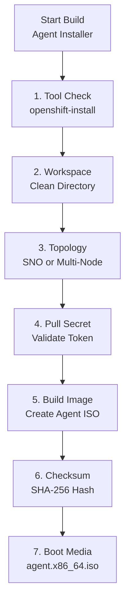
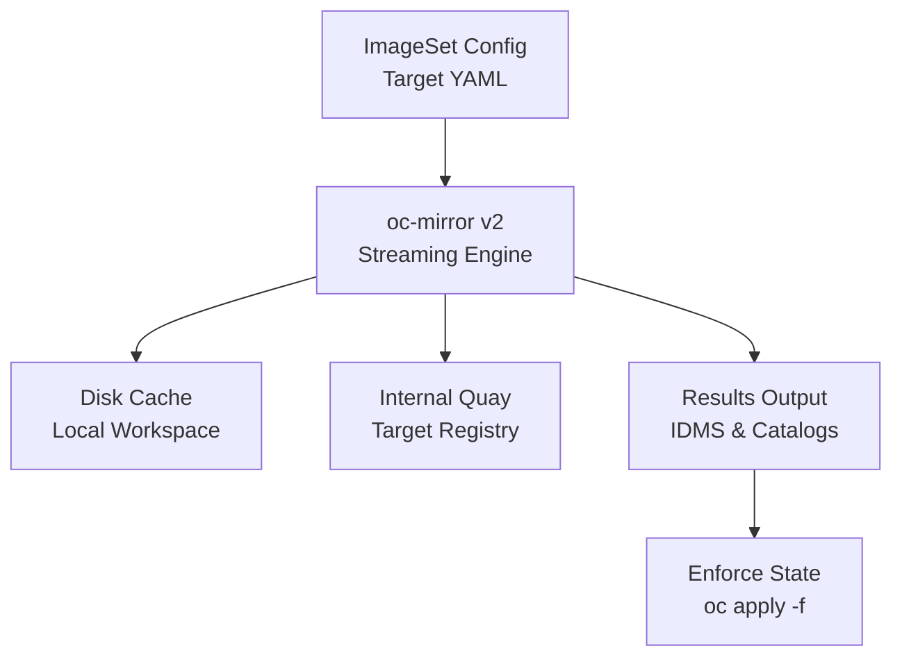
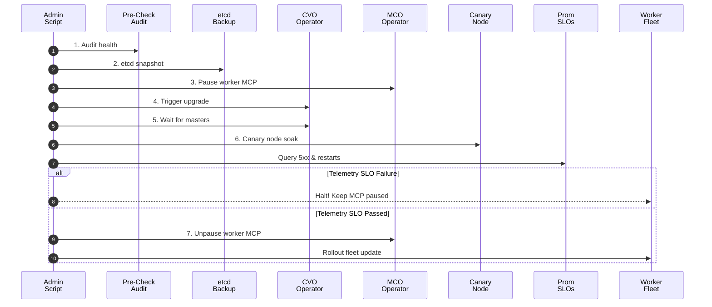
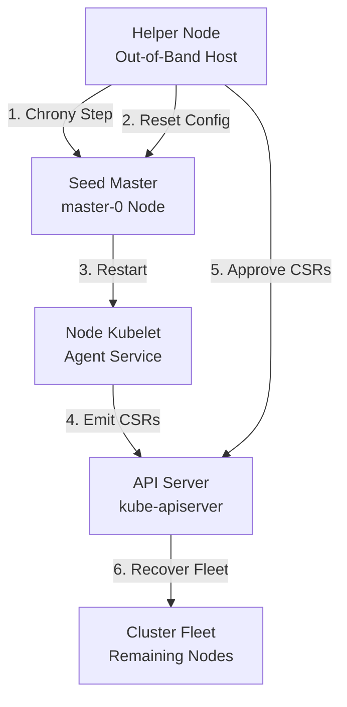
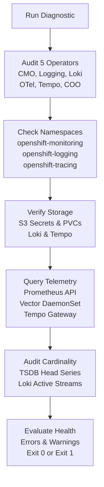

# OpenShift 4.20 Production Automation & Operational Tooling Manual (`scripts/`)

This directory houses the production-tested shell and PowerShell automation scripts supporting the entire lifecycle of enterprise Red Hat OpenShift 4.20 clusters—spanning **Day 0 Preflight & Provisioning**, **Day 1 Health Baselining**, **Day 2 Telemetry-Gated Canary Upgrades & DR**, and **Emergency Out-of-Band Disaster Recovery**.

---

## Table of Contents

- [Architectural Overview & Execution Topology](#architectural-overview--execution-topology)
  - [Execution Context Matrix](#execution-context-matrix)
  - [Design Philosophy & Hardening Standards](#design-philosophy--hardening-standards)
  - [Exit Code Conventions](#exit-code-conventions)
- [Master Automation Scripts Matrix](#master-automation-scripts-matrix)
- [Day 0: Preflight, Provisioning & Media Generation](#day-0-preflight-provisioning--media-generation)
  - [1. `preflight-check.sh`](#1-preflight-checksh)
  - [2. `generate-agent-iso.sh`](#2-generate-agent-isosh)
  - [3. `mirror-ocp420-airgap.sh`](#3-mirror-ocp420-airgapsh)
  - [4. `deploy-hyperv-vms.ps1`](#4-deploy-hyperv-vmsps1)
- [Day 1: Post-Install Hardening & Health Baselining](#day-1-post-install-hardening--health-baselining)
  - [5. `validate-cluster-health.sh`](#5-validate-cluster-healthsh)
- [Day 2: Operations, Canary Upgrades & Disaster Recovery](#day-2-operations-canary-upgrades--disaster-recovery)
  - [6. `etcd-backup.sh`](#6-etcd-backupsh)
  - [7. `pre-upgrade-health-check.sh`](#7-pre-upgrade-health-checksh)
  - [8. `automated-cluster-upgrade.sh`](#8-automated-cluster-upgradesh)
  - [9. `airgap-upgrade.sh`](#9-airgap-upgradesh)
  - [10. `test-oadp-restore.sh`](#10-test-oadp-restoresh)
- [Day 2: Out-of-Band Emergency Triage & API-Less Recovery](#day-2-out-of-band-emergency-triage--api-less-recovery)
  - [11. `recover-expired-certs.sh`](#11-recover-expired-certssh)
  - [12. `helper-ssh-jump.sh`](#12-helper-ssh-jumpsh)
  - [13. `replace-control-plane-node.sh`](#13-replace-control-plane-nodesh)
  - [14. `reinstall-worker-node.sh`](#14-reinstall-worker-nodesh)
  - [15. `emergency-etcd-single-member.sh`](#15-emergency-etcd-single-membersh)
- [Cross-References & Architectural Documentation Mapping](#cross-references--architectural-documentation-mapping)
- [YouTube Automation Video Shorts & Quick References](#youtube-automation-video-shorts--quick-references)

---

## Architectural Overview & Execution Topology

In enterprise OpenShift deployments, automation scripts must function across distinctly different operational phases and network boundaries. A script executed before the cluster exists cannot rely on the Kubernetes API; similarly, emergency recovery scripts must execute out-of-band when control plane certificates are expired or etcd quorum is severed.



### Execution Context Matrix

| Execution Context | Target Host | Protocol / Mechanism | Primary Scripts |
| :--- | :--- | :--- | :--- |
| **Helper Node / Bastion** | Dedicated RHEL/CentOS server on provisioning subnet | Local shell, `dig`, `chronyc`, `oc-mirror`, SSH to nodes | `preflight-check.sh`, `generate-agent-iso.sh`, `mirror-ocp420-airgap.sh`, `recover-expired-certs.sh`, `helper-ssh-jump.sh`, `emergency-etcd-single-member.sh` |
| **Admin Workstation / CI/CD** | Engineer laptop, jumpbox, or GitLab/GitHub runner | HTTPS Kubernetes API (`oc`), Prometheus API | `validate-cluster-health.sh`, `pre-upgrade-health-check.sh`, `automated-cluster-upgrade.sh`, `airgap-upgrade.sh`, `test-oadp-restore.sh`, `replace-control-plane-node.sh`, `reinstall-worker-node.sh` |
| **Control Plane (RHCOS)** | Live master node filesystem | Local bash or `oc debug node/<master>` chroot | `etcd-backup.sh` |
| **Hypervisor Host** | Windows Server 2022/2025 or Azure Stack HCI | PowerShell 5.1/7.x Hyper-V Module | `deploy-hyperv-vms.ps1` |

### Design Philosophy & Hardening Standards

Every script adheres to rigorous enterprise software engineering standards:
1. **Defensive Shell Execution (`set -euo pipefail`)**: All bash scripts terminate immediately on unhandled non-zero exits, unset variables, or failed pipeline stages.
2. **Environment Variable Overridability**: All core parameters (VIPs, domain names, timeouts, directories, SSH keys) have production defaults but can be overridden cleanly via environment variables without editing the source code.
3. **Idempotency & Non-Destructive Invocations**: Preflight checks, audits, and health verifications read cluster state without mutating resources. Destructive operations (such as cordoning, node deletion, or quorum reduction) enforce safety checks and confirmation prompts.
4. **ANSI Color-Coded Structured Output**: Standardized logging prefixes (`[PASS]`, `[WARN]`, `[FAIL]`, `[INFO]`) provide immediate visual feedback during CLI execution and parse cleanly in automated CI/CD pipelines.

### Exit Code Conventions

| Exit Code | Semantic Meaning | Recommended Operational Action |
| :---: | :--- | :--- |
| `0` | **Success / Healthy** | Proceed to next operational phase or pipeline step. |
| `1` | **Failure / Error** | Execution halted due to missing dependencies, fatal prerequisite failure, or failed operation. Investigate root cause before retrying. |
| `2` | **SLO Breach / Warning Abort** | Specific to `automated-cluster-upgrade.sh` and `helper-ssh-jump.sh`: Prometheus canary telemetry exceeded error budgets or direct SSH failed without BMC parameters. |

---

## Master Automation Scripts Matrix

| # | Script Name | Language | Execution Context | Target Phase | API Dependent? | Purpose |
| :-: | :--- | :--- | :--- | :--- | :-: | :--- |
| **1** | [`preflight-check.sh`](#1-preflight-checksh) | Bash | Helper / Bastion | Day 0 | No | Audits DNS, reverse PTR, NTP sync, proxy variables, and VIP port reachability. |
| **2** | [`generate-agent-iso.sh`](#2-generate-agent-isosh) | Bash | Helper / Workstation | Day 0 | No | Builds bootable Agent-Based Installer (ABI) ISO for SNO, Compact, or Standard topologies. |
| **3** | [`mirror-ocp420-airgap.sh`](#3-mirror-ocp420-airgapsh) | Bash | Helper / Mirror Host | Day 0 | No | Automates disconnected `oc-mirror` v2 mirroring to enterprise registry (Quay/Harbor). |
| **4** | [`deploy-hyperv-vms.ps1`](#4-deploy-hyperv-vmsps1) | PowerShell | Hyper-V Host | Day 0 | No | Provisions Gen 2 VMs with Secure Boot, disabled dynamic memory, and Keepalived MAC spoofing. |
| **5** | [`validate-cluster-health.sh`](#5-validate-cluster-healthsh) | Bash | Admin Workstation | Day 1 / Post-Install | Yes | Evaluates ClusterOperators, MachineConfigPools, node readiness, Ingress, and StorageClasses. |
| **6** | [`etcd-backup.sh`](#6-etcd-backupsh) | Bash | Control Plane / `oc` | Day 2 Operations | Yes | Takes non-disruptive master etcd snapshots with automated 14-day retention pruning. |
| **7** | [`pre-upgrade-health-check.sh`](#7-pre-upgrade-health-checksh) | Bash | Admin Workstation | Day 2 Upgrades | Yes | Upgrade gatekeeper auditing operators, MCPs, nodes, etcd backup freshness, and deprecated APIs. |
| **8** | [`automated-cluster-upgrade.sh`](#8-automated-cluster-upgradesh) | Bash | Admin Workstation | Day 2 Upgrades | Yes | Orchestrates end-to-end upgrades with paused worker MCPs and Prometheus/Thanos canary SLO gating. |
| **9** | [`airgap-upgrade.sh`](#9-airgap-upgradesh) | Bash | Helper / Mirror Host | Day 2 Upgrades | Partial | Generates dynamic ImageSetConfiguration, mirrors payload via `oc-mirror` v2, and applies IDMS. |
| **10** | [`test-oadp-restore.sh`](#10-test-oadp-restoresh) | Bash | Admin Workstation | Day 2 DR Drills | Yes | Automated DR drill harness: restores latest OADP backup into ephemeral namespace and measures RTO/RPO. |
| **11** | [`recover-expired-certs.sh`](#11-recover-expired-certssh) | Bash | Helper Node | Emergency Triage | No (Bypasses API) | Restores expired kubelet/API certificates after prolonged offline shutdown via out-of-band SSH. |
| **12** | [`helper-ssh-jump.sh`](#12-helper-ssh-jumpsh) | Bash | Helper Node | Emergency Triage | No | Provides out-of-band SSH jumping with automated key discovery and IPMI Serial-Over-LAN fallback. |
| **13** | [`replace-control-plane-node.sh`](#13-replace-control-plane-nodesh) | Bash | Admin Workstation | Emergency Triage | Yes | Purges failed master from etcd Raft consensus, deletes Node CR, and monitors reprovisioning CSRs. |
| **14** | [`reinstall-worker-node.sh`](#14-reinstall-worker-nodesh) | Bash | Admin Workstation | Emergency Triage | Yes | Gracefully cordons, drains, deletes degraded worker node, and monitors replacement provisioning. |
| **15** | [`emergency-etcd-single-member.sh`](#15-emergency-etcd-single-membersh) | Bash | Helper Node | Emergency Triage | No (Bypasses API) | Recovers from catastrophic multi-master quorum loss by forcing a single master into a 1-node etcd cluster. |
| **16** | [`verify-observability-stack.sh`](#16-verify-observability-stacksh) | Bash | Admin Workstation | Day 2 Operations | Yes | Comprehensive health audit for CMO, UWM, Logging 6.x Vector, LokiStack, Tempo, and Korrel8r. |

---

## Day 0: Preflight, Provisioning & Media Generation

### 1. `preflight-check.sh`

#### Motivation & Operational Rationale
Over 80% of OpenShift installation failures stem from pre-existing datacenter infrastructure misconfigurations: unresolvable DNS records, split-brain reverse PTR lookups, clock skew exceeding etcd Raft latency limits, or misconfigured corporate proxy bypass rules (`NO_PROXY`). Running manual `dig` or `curl` checks across dozens of endpoints is error-prone. `preflight-check.sh` provides a deterministic, automated Day 0 gatekeeper that validates all network, name resolution, time synchronization, and firewall port requirements before booting cluster nodes.

#### Architectural Placement & Workflow
The script runs on the **Helper Node / Bastion Host** or the installation workstation on the same Layer 2/3 broadcast domain as the planned cluster VIPs.



```text
[ Start: preflight-check.sh ]
             │
             ▼
[ 1. Check Core DNS (api, api-int, *.apps VIPs) ]
             │
             ▼
[ 2. Check Reverse PTR (Validate IP to Hostname) ]
             │
             ▼
[ 3. Check Clock Sync (Chrony RMS Offset < 500ms) ]
             │
             ▼
[ 4. Check Proxy Settings (HTTP_PROXY & NO_PROXY) ]
             │
             ▼
[ 5. Probe Target Ports (TCP 6443, 22623, 443) ]
             │
             ▼
      < Any Failures? >
       /             \
 [ Yes: Fail > 0 ]   [ No: All Passed ]
       │                     │
       ▼                     ▼
[ Exit 1: Abort Boot ]  [ Exit 0: Proceed ]
```

#### Hands-On CLI Execution
```bash
# 1. Standard execution with environment overrides
CLUSTER_NAME="ocp-prod" \
BASE_DOMAIN="datacenter.corp" \
API_VIP="10.50.10.100" \
APPS_VIP="10.50.10.101" \
./scripts/preflight-check.sh

# 2. Execution in proxy-restricted enterprise environment
HTTP_PROXY="http://proxy.corp:8080" \
NO_PROXY=".datacenter.corp,10.128.0.0/14,172.30.0.0/16,10.50.10.0/24" \
./scripts/preflight-check.sh
```

#### Configuration Options

| Variable | Default Value | Description |
| :--- | :--- | :--- |
| `CLUSTER_NAME` | `ocp420` | Cluster prefix name used to construct DNS FQDNs. |
| `BASE_DOMAIN` | `example.com` | Base enterprise root DNS domain. |
| `API_VIP` | `192.168.10.100` | Target virtual IP for `api` (6443) and `api-int` (22623). |
| `APPS_VIP` | `192.168.10.101` | Target virtual IP for wildcard Ingress router (443). |
| `HTTP_PROXY` | *(empty)* | Optional HTTP proxy URL for outbound egress. |
| `NO_PROXY` | *(empty)* | Mandatory proxy bypass list if `HTTP_PROXY` is defined. |

#### Expected Output
```text
======================================================================
 OpenShift 4.20 Preflight Readiness Validator - September 2026
 Cluster: ocp-prod.datacenter.corp
======================================================================

--- 1. Checking Core DNS Records ---
[PASS] DNS record 'api.ocp-prod.datacenter.corp' correctly resolved to '10.50.10.100'
[PASS] DNS record 'api-int.ocp-prod.datacenter.corp' correctly resolved to '10.50.10.100'
[PASS] DNS record 'canary-test.apps.ocp-prod.datacenter.corp' correctly resolved to '10.50.10.101'

--- 2. Checking Reverse PTR Records ---
[PASS] Reverse PTR for 10.50.10.100 resolves to: api.ocp-prod.datacenter.corp
[PASS] Reverse PTR for 10.50.10.101 resolves to: *.apps.ocp-prod.datacenter.corp

--- 3. Checking System Clock & NTP Sync ---
[PASS] Chrony is synchronized. RMS offset: 0.000042 seconds

--- 4. Checking Proxy Environment Variables ---
[PASS] No proxy configured (direct connection mode)

--- 5. Checking Port Accessibility ---
[WARN] Connection to 10.50.10.100:6443 (OpenShift API Server) timed out or rejected (expected if not yet running)
[WARN] Connection to 10.50.10.100:22623 (Machine Config Server) timed out or rejected (expected if not yet running)
[WARN] Connection to 10.50.10.101:443 (Cluster Ingress Router HTTPS) timed out or rejected (expected if not yet running)

======================================================================
 Preflight Summary: 6 Passed, 3 Warnings, 0 Failed
======================================================================
```

---

### 2. `generate-agent-iso.sh`

#### Motivation & Operational Rationale
The Agent-Based Installer (ABI) is Red Hat's premier installation method for OpenShift 4.20, replacing legacy PXE/TFTP infrastructure with a self-contained, bootable ISO image. Manually invoking `openshift-install agent create image` often results in corrupt workspaces because the binary mutates files in place. `generate-agent-iso.sh` establishes an isolated, clean build environment, validates that the user pull secret is populated, copies the exact declarative topology manifests (`sno`, `compact`, or `standard`), builds the ISO, and outputs the cryptographic sha256 checksum for verification.

#### Architectural Placement & Workflow
Executes on the **Helper Node / Workstation** with outbound internet access (or local access to a mirror registry) and `openshift-install` installed.



```text
[ Start: generate-agent-iso.sh ]
               │
               ▼
[ 1. Verify openshift-install CLI in PATH ]
               │
               ▼
[ 2. Initialize Clean Build Directory (/var/tmp/ocp-agent-build) ]
               │
               ▼
[ 3. Copy Topology Config (SNO / Compact / Standard) ]
               │
               ▼
[ 4. Validate Pull Secret (Reject Dummy Strings) ]
               │
               ▼
[ 5. Run: openshift-install agent create image ]
               │
               ▼
[ 6. Generate SHA-256 Checksum ]
               │
               ▼
[ Output: Bootable agent.x86_64.iso Media Ready ]
```

#### Hands-On CLI Execution
```bash
# 1. Build Agent ISO for 3-Node Compact Converged Cluster
TOPOLOGY="compact" ./scripts/generate-agent-iso.sh

# 2. Build Agent ISO for Single Node OpenShift (SNO) in custom directory
TOPOLOGY="sno" \
WORKDIR="/data/iso-build/sno" \
CONFIG_SRC_DIR="configs/agent-based" \
./scripts/generate-agent-iso.sh

# 3. Mount ISO and monitor cluster convergence
openshift-install agent wait-for install-complete --dir=/var/tmp/ocp-agent-build
```

#### Configuration Options

| Variable | Default Value | Description |
| :--- | :--- | :--- |
| `TOPOLOGY` | `compact` | Topology profile to build: `compact`, `sno`, or `standard`. |
| `WORKDIR` | `/var/tmp/ocp-agent-build` | Isolated build directory where ISO artifacts are created. |
| `CONFIG_SRC_DIR` | `configs/agent-based` | Source directory containing `agent-config.yaml` and `install-config-*.yaml`. |

---

### 3. `mirror-ocp420-airgap.sh`

#### Motivation & Operational Rationale
In dark-site, disconnected, or classified enterprise networks, OpenShift nodes have zero access to `registry.redhat.io` or `quay.io`. `mirror-ocp420-airgap.sh` automates the enterprise **`oc-mirror` v2** mirroring engine. Compared to legacy v1, `oc-mirror` v2 provides native mirror-to-mirror streaming, dynamic caching, reproducible metadata generation, and automatic creation of `ImageDigestMirrorSet` (IDMS) and `ClusterCatalog` manifests.

#### Architectural Placement & Workflow
Executes on a dual-homed **Mirror Host / Helper Node** that has access to the destination enterprise registry (`quay.internal.corp:8443` or Harbor).



```text
[ ImageSetConfiguration (imageset-config-v2.yaml) ]
                        │
                        ▼
       [ oc-mirror v2 Streaming Engine ]
        /               │              \
       ▼                ▼               ▼
[ Disk Cache ]   [ Quay / Harbor ]   [ Results Workspace ]
                                                │
                                                ▼
                                    [ Apply IDMS to Cluster ]
```

#### Hands-On CLI Execution
```bash
# 1. Mirror OpenShift 4.20 core release payload to internal Quay
OCP_VERSION="4.20.0" \
DESTINATION_REGISTRY="quay.internal.corp:8443/openshift4" \
CONFIG_FILE="configs/airgap/imageset-config-v2.yaml" \
./scripts/mirror-ocp420-airgap.sh

# 2. Apply generated IDMS manifests to the cluster
oc apply -f /var/tmp/oc-mirror-workspace/results-*/
```

---

### 4. `deploy-hyperv-vms.ps1`

#### Motivation & Operational Rationale
Deploying OpenShift 4.20 on Microsoft Hyper-V or Azure Stack HCI requires strict adherence to hardware virtualization flags that differ from VMware or Bare Metal. Specifically:
- **Dynamic Memory MUST be disabled**: etcd and the kubelet perform memory allocation assertions; memory ballooning will trigger kernel panics or etcd leader drops.
- **Secure Boot UEFI Certificate**: RHCOS kernels require the `MicrosoftUEFICertificateAuthority` template (not Standard Windows).
- **MAC Address Spoofing MUST be enabled**: Keepalived VRRP failover for the API and Ingress VIPs requires virtual NICs to emit frames for multiple MAC addresses.

`deploy-hyperv-vms.ps1` automates the creation of Generation 2 VMs, disables Dynamic Memory, sets the correct Secure Boot template, enables MAC spoofing, creates virtual hard disks, and attaches the Agent ISO.

#### Hands-On CLI Execution (PowerShell 5.1/7.x)
```powershell
# 1. Deploy standard 3-Master, 2-Worker topology on Hyper-V
.\scripts\deploy-hyperv-vms.ps1 `
    -ClusterName "ocp420" `
    -SwitchName "ExternalSwitch" `
    -IsoPath "C:\ISO\agent.x86_64.iso" `
    -VmPath "D:\Hyper-V\Virtual Machines" `
    -MasterCount 3 `
    -WorkerCount 2

# 2. Deploy Single Node OpenShift (SNO) lab instance
.\scripts\deploy-hyperv-vms.ps1 `
    -ClusterName "ocp-sno" `
    -MasterCount 1 `
    -WorkerCount 0 `
    -MasterCpu 16 `
    -MasterRamBytes 64GB `
    -MasterDiskBytes 250GB
```

---

## Day 1: Post-Install Hardening & Health Baselining

### 5. `validate-cluster-health.sh`

#### Motivation & Operational Rationale
Following installation or Day 1 configuration changes (such as custom TLS certificates, dedicated Ingress controllers, or ODF storage rollout), platform administrators must verify overall cluster state. `validate-cluster-health.sh` performs an exhaustive audit across the five foundational layers of OpenShift:
1. **ClusterOperators**: Verifies that all 34+ core operators report `Available=True`, `Progressing=False`, and `Degraded=False`.
2. **MachineConfigPools (MCP)**: Ensures control plane and worker pools have rendered configurations and are not degraded.
3. **Node Readiness**: Audits all cluster nodes to ensure none are in `NotReady` or `SchedulingDisabled` states.
4. **Ingress Controllers**: Validates the default IngressController condition status.
5. **StorageClasses**: Confirms that a default StorageClass exists for dynamic volume provisioning.

#### Hands-On CLI Execution
```bash
export KUBECONFIG=/path/to/auth/kubeconfig
./scripts/validate-cluster-health.sh
```

#### Expected Output
```text
======================================================================
 OpenShift 4.20 Comprehensive Cluster Health Verification
======================================================================

--- 1. Checking Cluster Operators ---
[HEALTHY] All 34+ Cluster Operators are Available=True, Progressing=False, Degraded=False.

--- 2. Checking MachineConfigPools (MCP) ---
[HEALTHY] All MachineConfigPools are Updated=True and Degraded=False.

--- 3. Checking Nodes Status ---
[HEALTHY] All 6 nodes are in 'Ready' state.

--- 4. Checking Ingress Controller & Router Pods ---
[HEALTHY] Default IngressController is Available.

--- 5. Checking StorageClasses ---
[CONFIGURED] Default StorageClass is set to: ocs-storagecluster-ceph-rbd

======================================================================
 Validation Complete!
======================================================================
```

---

## Day 2: Operations, Canary Upgrades & Disaster Recovery

### 6. `etcd-backup.sh`

#### Motivation & Operational Rationale
etcd holds the entire state and declarative configuration of the OpenShift cluster. Upstream etcd backups must capture a consistent point-in-time Raft snapshot alongside the static pod encryption keys. `etcd-backup.sh` executes the non-disruptive, official Red Hat snapshot procedure. It supports dual execution modes:
- **Local Execution**: When executed directly on a master node via `/usr/local/bin/cluster-backup.sh`.
- **Remote Execution**: When executed from an admin workstation via `oc debug node/<master>` chroot.
It automatically verifies snapshot file size and enforces an automated retention policy (default: 14 days) to prevent disk exhaustion.

#### Hands-On CLI Execution
```bash
# 1. Run remotely against the cluster via oc client
export KUBECONFIG=/path/to/auth/kubeconfig
./scripts/etcd-backup.sh

# 2. Run locally on a master node with custom retention policy
BACKUP_DIR="/mnt/nfs/etcd-backups" \
RETENTION_DAYS="30" \
./scripts/etcd-backup.sh
```

---

### 7. `pre-upgrade-health-check.sh`

#### Motivation & Operational Rationale
Triggering an OpenShift cluster upgrade while an operator is degraded, a MachineConfigPool is rolling out, or etcd lacks a fresh backup frequently results in cluster deadlocks and prolonged downtime. `pre-upgrade-health-check.sh` acts as a strict programmatic gatekeeper. It audits:
1. Operator degradation status.
2. MachineConfigPool updating/degraded states.
3. Node readiness.
4. **Mandatory etcd Backup Freshness**: Verifies that a valid snapshot was recorded within the last 24 hours.
5. **Deprecated API Usage**: Queries `apirequestcounts` to ensure no removed APIs will break post-upgrade workloads.
6. **Prometheus Critical Alerts**: Queries the in-cluster Prometheus server for active firing `severity="critical"` alerts.

If any check fails, the script exits with `exit 1`, stopping automated upgrade pipelines before changes are committed.

#### Hands-On CLI Execution
```bash
export KUBECONFIG=/path/to/auth/kubeconfig
./scripts/pre-upgrade-health-check.sh
```

---

### 8. `automated-cluster-upgrade.sh`

#### Motivation & Operational Rationale
Upgrading enterprise OpenShift clusters without orchestration causes massive worker node reboot storms: every worker simultaneously drains, causing application evictions, router degradation, and cascading outages. `automated-cluster-upgrade.sh` implements an industry-leading, 7-step telemetry-gated canary upgrade pattern:



```text
Admin Script       Pre-Audit     etcd Backup      CVO Operator     MCO Operator    Canary Node     Prometheus     Worker Fleet
     │                 │              │                │                │               │              │               │
     ├──1. Audit──────►│              │                │                │               │              │               │
     ├──2. Snapshot──────────────────►│                │                │               │              │               │
     ├──3. Pause Worker MCP────────────────────────────────────────────►│               │              │               │
     ├──4. Trigger Upgrade────────────────────────────►│                │               │              │               │
     ├──5. Wait for Masters Available─────────────────►│                │               │              │               │
     ├──6. Upgrade & Soak Canary Node──────────────────────────────────────────────────►│              │               │
     ├──Query Ingress 5xx & Restarts──────────────────────────────────────────────────────────────────►│               │
     │ [ SLO Failure: Halt Rollout, Keep Worker MCP Paused ]                                                           │
     ├──7. SLO Passed: Unpause Worker MCP──────────────────────────────►│                                              │
     └──Wait for Fleet Convergence (Updated=True)─────────────────────────────────────────────────────────────────────►│
```

#### Hands-On CLI Execution
```bash
# 1. Standard upgrade to target version with automated canary testing
export KUBECONFIG=/path/to/auth/kubeconfig
./scripts/automated-cluster-upgrade.sh 4.20.1 worker-0.datacenter.corp

# 2. Upgrade with extended telemetry soak time (300 seconds)
SOAK_SECONDS=300 ./scripts/automated-cluster-upgrade.sh 4.20.1 worker-0.datacenter.corp
```

#### Configuration Options

| Parameter / Variable | Type | Description |
| :--- | :--- | :--- |
| `$1` (`TARGET_VERSION`) | Argument | Target OpenShift release version (e.g., `4.20.1`). |
| `$2` (`CANARY_NODE`) | Argument (Optional) | Specific worker node FQDN to isolate in `worker-canary` pool. |
| `SOAK_SECONDS` | Env Var (Default: `60`) | Duration to soak canary node while evaluating Prometheus error budgets. |

---

### 9. `airgap-upgrade.sh`

#### Motivation & Operational Rationale
In disconnected environments, upgrading requires mirroring the target release payload to the local registry, updating `ImageDigestMirrorSet` (IDMS) CRDs, resolving the release digest, and instructing the Cluster Version Operator (CVO) to upgrade from a local image URL. `airgap-upgrade.sh` dynamically generates the required `ImageSetConfiguration`, triggers `oc-mirror` v2, applies the generated manifests, resolves the image digest using `oc adm release info`, and initiates the upgrade.

#### Hands-On CLI Execution
```bash
LOCAL_REGISTRY="quay.internal.corp:8443/openshift4" \
./scripts/airgap-upgrade.sh 4.20.1
```

---

### 10. `test-oadp-restore.sh`

#### Motivation & Operational Rationale
Backups that are not regularly tested for restoration are not reliable backups. Red Hat OADP (OpenShift API for Data Protection) protects stateful workloads, but silent failures (such as CSI volume snapshot timeouts, missing secrets, or storage class mismatches) only emerge during true disasters. `test-oadp-restore.sh` acts as an automated, continuous DR verification harness:
1. Discovers the latest completed backup for a specified source namespace.
2. Creates an isolated, ephemeral target namespace (`dr-verify-<timestamp>`).
3. Executes an OADP restore targeting the ephemeral namespace.
4. Waits for pods to achieve `Ready` status and executes synthetic health checks.
5. Calculates real **RTO** (Recovery Time Objective) and **RPO** (Recovery Point Objective).
6. Safely cleans up ephemeral resources.

#### Hands-On CLI Execution
```bash
# 1. Test DR restore of production database namespace
export KUBECONFIG=/path/to/auth/kubeconfig
./scripts/test-oadp-restore.sh postgres-db --timeout 300

# 2. Run via automated cron job / monitoring probe
0 3 * * 0 /opt/scripts/test-oadp-restore.sh payment-services >> /var/log/oadp-drill.log 2>&1
```

---

## Day 2: Out-of-Band Emergency Triage & API-Less Recovery

### 11. `recover-expired-certs.sh`

#### Motivation & Operational Rationale
When an OpenShift cluster remains powered off or disconnected for longer than the validity period of the kubelet client and serving certificates (typically 30 days), the node kubelets cannot authenticate with the API server. In this condition:
- The Kubernetes API is completely unreachable (`Unable to connect to the server`).
- `oc` commands fail with certificate expiration errors.
- The cluster cannot self-heal because the CSR approver pod cannot run.

`recover-expired-certs.sh` solves this catastrophic deadlock by operating **out-of-band directly from the Helper Node via SSH**. It bypasses the offline API server, accesses the seed master node, restores the bootstrap kubeconfig, starts the local kubelet, leverages the local static pod administrative credentials to approve pending CSRs, and propagates recovery across all remaining control plane and worker nodes.

#### Architectural Placement & Workflow



```text
[ Helper Node (Out-of-Band SSH) ]
              │
              ├─► 1. Synchronize system clock (chronyc makestep)
              ├─► 2. Restore bootstrap kubeconfig to /etc/kubernetes/
              │
              ▼
    [ Seed Master (master-0) ]
              │
              ├─► 3. Restart kubelet service
              ├─► 4. Kubelet generates new client/serving CSRs
              │
              ▼
    [ Control Plane API Server ]
              │
              ├─► 5. Helper Node approves CSRs via localhost admin kubeconfig
              │
              ▼
[ Full Fleet Convergence (Loop over master-1, master-2, and workers) ]
```

#### Hands-On CLI Execution
```bash
# Run from Helper Node with target master hostnames
SSH_KEY="/root/.ssh/id_rsa_ocp" \
MASTERS="master-0.corp.local master-1.corp.local master-2.corp.local" \
WORKERS="worker-0.corp.local worker-1.corp.local" \
./scripts/recover-expired-certs.sh
```

---

### 12. `helper-ssh-jump.sh`

#### Motivation & Operational Rationale
In hardened enterprise clusters, RHCOS nodes do not expose public SSH or direct console ports. During network partitioning, node routing table corruption, or SSH daemon failures, administrators cannot run `oc debug node`. `helper-ssh-jump.sh` provides an out-of-band jump utility executed from the Helper Node. It probes SSH reachability with automated key discovery; if SSH fails, it automatically falls back to out-of-band **IPMI Serial-Over-LAN (SOL)** via the hardware Baseboard Management Controller (BMC/iDRAC/iLO), giving administrators a direct serial console into the dying node.

#### Hands-On CLI Execution
```bash
# 1. Interactive SSH shell into master-0
./scripts/helper-ssh-jump.sh master-0.corp.local

# 2. Run remote diagnostic command non-interactively
./scripts/helper-ssh-jump.sh master-0.corp.local "crictl ps && systemctl status kubelet"

# 3. Fallback to IPMI SOL console if SSH is dead
BMC_IP="10.50.10.200" BMC_USER="root" BMC_PASS="calvin" \
./scripts/helper-ssh-jump.sh master-0.corp.local
```

---

### 13. `replace-control-plane-node.sh`

#### Motivation & Operational Rationale
When a control plane node suffers catastrophic hardware or hypervisor corruption, simply powering on a new node with the same IP will fail: etcd Raft consensus still expects the old member ID, and the Machine Config Operator will reject node synchronization. `replace-control-plane-node.sh` automates the master node replacement lifecycle:
1. **Quorum Verification**: Verifies that at least 2 healthy masters remain online (preventing accidental total quorum loss).
2. **etcd Member Removal**: Queries the surviving etcd cluster, locates the failed node's member ID, and executes `etcdctl member remove`.
3. **Node Object Cleanup**: Deletes the dead Kubernetes `Node` and `Machine` CRs.
4. **Reprovisioning Guidance**: Provides specific boot instructions for Bare Metal (Agent ISO), ACM, or Cloud IPI.
5. **CSR Approval Loop**: Actively monitors and approves the replacement node's incoming `kubelet-client` and `kubelet-serving` CSRs until the node rejoins etcd.

#### Hands-On CLI Execution
```bash
export KUBECONFIG=/path/to/auth/kubeconfig
./scripts/replace-control-plane-node.sh master-1.datacenter.corp
```

---

### 14. `reinstall-worker-node.sh`

#### Motivation & Operational Rationale
Degraded or hardware-faulted worker nodes must be reinstalled without interrupting stateful application workloads or breaching Pod Disruption Budgets (PDBs). `reinstall-worker-node.sh` safely cordons the node, evicts workloads with configurable drain timeouts, deletes the Kubernetes Node object, and monitors the replacement node's provisioning, automatically approving CSRs and waiting for MachineConfigPool synchronization.

#### Hands-On CLI Execution
```bash
# Cordon, drain with 15-minute timeout, and reprovision worker
export KUBECONFIG=/path/to/auth/kubeconfig
./scripts/reinstall-worker-node.sh worker-2.datacenter.corp 15
```

---

### 15. `emergency-etcd-single-member.sh`

#### Motivation & Operational Rationale
In a 3-node control plane, if 2 master nodes fail simultaneously (due to dual hardware faults, SAN corruption, or operator error), etcd Raft consensus is permanently broken. The surviving master cannot achieve a quorum majority (`1 of 3 = 33% < 51%`) and refuses all read/write requests, taking the entire cluster offline.

`emergency-etcd-single-member.sh` forces the single surviving master node into a standalone, 1-node etcd cluster. It executes out-of-band via SSH from the Helper Node:
1. Quenches local static pods (`etcd-member`, `kube-apiserver`) by moving manifests out of `/etc/kubernetes/manifests/`.
2. Captures an emergency point-in-time snapshot of the surviving database.
3. Invokes `/usr/local/bin/etcd-snapshot-restore.sh` or strips peer metadata to reset the etcd cluster membership to single-member mode.
4. Restores static pod manifests, verifies that the local kube-apiserver becomes healthy, and restores cluster operations so replacement masters can be joined.

#### Hands-On CLI Execution
```bash
# Execute from Helper Node targeting the surviving master
SSH_KEY="/root/.ssh/id_rsa_ocp" \
./scripts/emergency-etcd-single-member.sh master-0.datacenter.corp
```

---

### 16. `verify-observability-stack.sh`

#### Motivation & Operational Rationale
In OpenShift 4.20, enterprise observability spans five interconnected operators, two object storage backends, and multiple telemetry collection daemons. A failure in any single layer (such as an expired S3 secret, an unready Vector DaemonSet, an unconfigured OpenMetrics exemplar store, or high-cardinality label explosions) breaks telemetry correlation and blinds platform SREs.

`verify-observability-stack.sh` provides an end-to-end automated health audit across the complete native observability fabric:
1. **Operator Health**: Validates CSV subscription status for Cluster Monitoring, OpenShift Logging 6.x, Loki Operator, OpenTelemetry, Tempo, COO, and Network Observability.
2. **Namespace Inspection**: Verifies pod status across `openshift-monitoring`, `openshift-user-workload-monitoring`, `openshift-logging`, `openshift-tracing`, and `openshift-netobserv`.
3. **Storage Fabric**: Confirms reachability of S3 object storage secrets (`logging-loki-s3`, `tempostack-s3`) and persistent volume claims.
4. **Correlation & Exemplars**: Checks for OpenMetrics exemplar storage activation in `cluster-monitoring-config` and verifies console plugin registrations.
5. **Cardinality Governance**: Directly inspects Prometheus TSDB active head series counts and alerts if series exceed safe thresholds (>3,000,000 active series).

#### Workflow Diagram



```text
+-------------------------------------------------------+
|        verify-observability-stack.sh Execution        |
+-------------------------------------------------------+
                           |
                           v
   +-------------------------------------------------+
   | Step 1: Audit 5 Core Observability Operators    |
   | (CMO, Logging 6.x, Loki, OTel, Tempo, COO)      |
   +-------------------------------------------------+
                           |
                           v
   +-------------------------------------------------+
   | Step 2: Namespace & Pod Health Inspections      |
   | (openshift-monitoring, logging, tracing, netobs)|
   +-------------------------------------------------+
                           |
                           v
   +-------------------------------------------------+
   | Step 3: Storage Fabric & S3 Bucket Verification |
   | (logging-loki-s3, tempostack-s3, WAL PVCs)      |
   +-------------------------------------------------+
                           |
                           v
   +-------------------------------------------------+
   | Step 4: Ingestion & Exemplar Verification       |
   | (Prometheus UWM, Vector DaemonSets, Tempo OTLP) |
   +-------------------------------------------------+
                           |
                           v
   +-------------------------------------------------+
   | Step 5: Cardinality & Series Analysis           |
   | (Active TSDB head series, Loki streams count)   |
   +-------------------------------------------------+
                           |
                           v
   +-------------------------------------------------+
   | Step 6: Summary Assessment (Exit 0 or Exit 1)   |
   +-------------------------------------------------+
```

#### Hands-On CLI Execution
```bash
# Execute from Admin Workstation with cluster-admin credentials
./scripts/verify-observability-stack.sh
```

---

## Cross-References & Architectural Documentation Mapping

Each automation script maps directly to dedicated architectural documentation modules and production configuration manifests within this repository:

| Operational Domain | Relevant Automation Scripts | Architectural Documentation Guides | Production Configuration Manifests |
| :--- | :--- | :--- | :--- |
| **Day 0 Preflight & Sizing** | `preflight-check.sh` | [`docs/05-day0-readiness/02-dns-loadbalancer-matrix.md`](../docs/05-day0-readiness/02-dns-loadbalancer-matrix.md)<br/>[`docs/05-day0-readiness/04-helper-node-architecture.md`](../docs/05-day0-readiness/04-helper-node-architecture.md) | [`configs/helper-node/`](../configs/helper-node/) |
| **Agent-Based Provisioning** | `generate-agent-iso.sh` | [`docs/02-provisioning-paradigms/01-agent-based-installer.md`](../docs/02-provisioning-paradigms/01-agent-based-installer.md)<br/>[`docs/01-architecture-topologies/`](../docs/01-architecture-topologies/) | [`configs/agent-based/`](../configs/agent-based/) |
| **Air-Gapped Operations** | `mirror-ocp420-airgap.sh`<br/>`airgap-upgrade.sh` | [`docs/03-network-and-connectivity/02-air-gapped-oc-mirror-v2.md`](../docs/03-network-and-connectivity/02-air-gapped-oc-mirror-v2.md)<br/>[`docs/03-network-and-connectivity/03-air-gapped-core-services.md`](../docs/03-network-and-connectivity/03-air-gapped-core-services.md) | [`configs/airgap/`](../configs/airgap/) |
| **Hyper-V / Virtualization** | `deploy-hyperv-vms.ps1` | [`docs/04-platforms/08-microsoft-hyper-v.md`](../docs/04-platforms/08-microsoft-hyper-v.md) | [`configs/upi-vsphere/`](../configs/upi-vsphere/) |
| **Post-Install Hardening** | `validate-cluster-health.sh` | [`docs/06-day1-baselining/01-cluster-operator-hardening.md`](../docs/06-day1-baselining/01-cluster-operator-hardening.md)<br/>[`docs/06-day1-baselining/04-machineconfigpools-tuning.md`](../docs/06-day1-baselining/04-machineconfigpools-tuning.md) | [`configs/day1/`](../configs/day1/) |
| **Canary Upgrades & Lifecycle** | `pre-upgrade-health-check.sh`<br/>`automated-cluster-upgrade.sh` | [`docs/07-day2-operations/04-lifecycle-and-upgrades.md`](../docs/07-day2-operations/04-lifecycle-and-upgrades.md)<br/>[`docs/07-day2-operations/05-automated-upgrades.md`](../docs/07-day2-operations/05-automated-upgrades.md) | [`configs/day2/`](../configs/day2/) |
| **Observability & Tracing** | `verify-observability-stack.sh` | [`docs/07-day2-operations/01-observability-stack.md`](../docs/07-day2-operations/01-observability-stack.md) | [`configs/observability/`](../configs/observability/) |
| **Disaster Recovery & OADP** | `etcd-backup.sh`<br/>`test-oadp-restore.sh` | [`docs/08-backup-dr-and-rebuild/01-etcd-backup-restore.md`](../docs/08-backup-dr-and-rebuild/01-etcd-backup-restore.md)<br/>[`docs/08-backup-dr-and-rebuild/02-oadp-vs-velero-deepdive.md`](../docs/08-backup-dr-and-rebuild/02-oadp-vs-velero-deepdive.md) | [`configs/day2/oadp-dpa-cr.yaml`](../configs/day2/oadp-dpa-cr.yaml) |
| **Emergency Runbooks** | `recover-expired-certs.sh`<br/>`helper-ssh-jump.sh`<br/>`replace-control-plane-node.sh`<br/>`reinstall-worker-node.sh`<br/>`emergency-etcd-single-member.sh` | [`docs/09-emergency-runbooks/README.md`](../docs/09-emergency-runbooks/README.md)<br/>[`docs/09-emergency-runbooks/01-expired-certs-recovery.md`](../docs/09-emergency-runbooks/01-expired-certs-recovery.md)<br/>[`docs/09-emergency-runbooks/02-helper-node-access-and-jumping.md`](../docs/09-emergency-runbooks/02-helper-node-access-and-jumping.md)<br/>[`docs/09-emergency-runbooks/03-node-reinstallation-and-replacement.md`](../docs/09-emergency-runbooks/03-node-reinstallation-and-replacement.md)<br/>[`docs/09-emergency-runbooks/04-etcd-quorum-loss-recovery.md`](../docs/09-emergency-runbooks/04-etcd-quorum-loss-recovery.md) | [`configs/helper-node/`](../configs/helper-node/) |

---

## YouTube Automation Video Shorts & Quick References

Technical, 60-to-90 second field walkthroughs demonstrating these automation scripts in real-world scenarios are published on the **[Nubenetes YouTube Channel (@nubenetes)](https://www.youtube.com/@nubenetes)**:

| Script / Tool | YouTube Short Video Title | Duration | Watch Link |
| :--- | :--- | :---: | :---: |
| [`preflight-check.sh`](preflight-check.sh) | [How OpenShift Automated Preflight Scripts Bulletproof Cluster Installations](https://www.youtube.com/shorts/UucLub-i270) | `1:02` | [▶️ Watch](https://www.youtube.com/shorts/UucLub-i270) |
| [`etcd-backup.sh`](etcd-backup.sh) | [How to Automate OpenShift etcd Snapshots and Retention Policies with Bash](https://www.youtube.com/shorts/o0hq2INBw1E) | `1:08` | [▶️ Watch](https://www.youtube.com/shorts/o0hq2INBw1E) |
| [`emergency-etcd-single-member.sh`](emergency-etcd-single-member.sh) | [How Emergency Scripts Resurrect Dead OpenShift Clusters After Quorum Failure](https://www.youtube.com/shorts/r2OhAxZU5gs) | `1:25` | [▶️ Watch](https://www.youtube.com/shorts/r2OhAxZU5gs) |
| [`test-oadp-restore.sh`](test-oadp-restore.sh) | [How to Automate OpenShift Disaster Recovery Drills with OADP and Kopia](https://www.youtube.com/shorts/5Jkl6h7uOgA) | `1:08` | [▶️ Watch](https://www.youtube.com/shorts/5Jkl6h7uOgA) |
| [`replace-control-plane-node.sh`](replace-control-plane-node.sh) | [How to Automate OpenShift Master Node Replacement Without Downtime](https://www.youtube.com/shorts/XgkB-eDbl_U) | `0:58` | [▶️ Watch](https://www.youtube.com/shorts/XgkB-eDbl_U) |
| [`automated-cluster-upgrade.sh`](automated-cluster-upgrade.sh) | [How OpenShift Canary Upgrades Protect Workloads with Automated SLO Gates](https://www.youtube.com/shorts/gN_-IyABljE) | `1:27` | [▶️ Watch](https://www.youtube.com/shorts/gN_-IyABljE) |
| [`mirror-ocp420-airgap.sh`](mirror-ocp420-airgap.sh)<br/>[`airgap-upgrade.sh`](airgap-upgrade.sh)<br/>[`helper-ssh-jump.sh`](helper-ssh-jump.sh) | [How to Survive OpenShift Air-Gapped Upgrades and Out-of-Band IPMI Recovery](https://www.youtube.com/shorts/CYX30kt1B_M) | `1:04` | [▶️ Watch](https://www.youtube.com/shorts/CYX30kt1B_M) |

*For complete end-to-end masterclasses and architecture podcasts, see the repository [Root Multimedia Catalog](../README.md#ai-generated-multimedia-series-youtube).*
